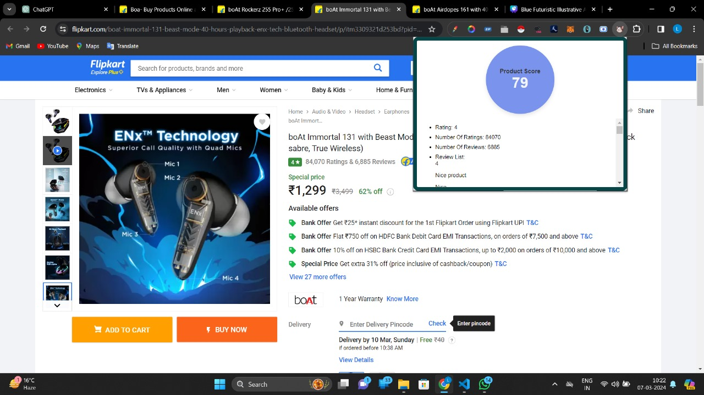

# Shop Smart - AI-Powered E-commerce Product Analyzer

## Team Name: Algorithm Alchemists

### Team Members:
- Mohd Dilshad (Leader)
- Mohd Aftab
- Prakash Singh Rawat
- Aman Singh

## Description
The Shop Smart Analyzer is a revolutionary Chrome extension designed to transform the e-commerce experience by providing comprehensive AI-powered product analysis. This innovative solution employs sophisticated analysis mechanisms including sentiment analysis of customer reviews to help users make informed purchasing decisions.

## ✨ Key Features

### 🔍 Advanced Product Analysis
- **Smart Product Detection**: Automatically detects product pages on major e-commerce platforms
- **Dynamic Data Extraction**: Extracts product information using robust CSS selectors (no XPath dependencies)
- **Multi-platform Support**: Works with Amazon, Flipkart, and other major e-commerce sites

### 📊 Comprehensive Review Analysis
- **20+ Review Extraction**: Automatically extracts up to 20 customer reviews for analysis
- **Sentiment Analysis**: Advanced sentiment analysis engine that categorizes reviews as positive, negative, or neutral
- **Sentiment Breakdown**: Visual representation of review sentiment distribution with percentages
- **Confidence Scoring**: Provides confidence levels for sentiment analysis results

### 🤖 AI-Powered Insights
- **Gemini AI Integration**: Leverages Google's Gemini AI for comprehensive product analysis
- **Multi-factor Scoring**: Evaluates products based on rating, reviews, warranty, and return policy
- **Smart Recommendations**: Provides actionable recommendations (Buy/Consider/Avoid)
- **Risk Assessment**: Identifies potential risk factors in purchasing decisions

### 📈 Enhanced User Experience
- **Real-time Analysis**: Fast, real-time product analysis with loading indicators
- **Interactive UI**: Clean, modern interface with expandable sections
- **Detailed Breakdowns**: Comprehensive analysis including pros, cons, and reasoning
- **Error Handling**: Robust error handling with fallback analysis when AI is unavailable

## 🛠️ Technical Features

### Review Sentiment Analysis Engine
- **Advanced Text Processing**: Cleans and normalizes review text for accurate analysis
- **Sentiment Word Dictionaries**: Uses comprehensive positive and negative word lists
- **Intensifier Detection**: Recognizes words that amplify sentiment (very, extremely, etc.)
- **Context Awareness**: Filters out non-review content and platform-specific text
- **Statistical Analysis**: Provides detailed sentiment statistics and breakdowns

### Data Extraction Capabilities
- **Product Information**: Name, price, rating, review counts, warranty, return policy
- **Review Mining**: Extracts meaningful customer reviews while filtering noise
- **Image Detection**: Collects product images for comprehensive analysis
- **Dynamic Selectors**: Adapts to different website layouts and structures

## 🎯 Problem Solving Approach

### Streamlined Product Evaluation
- **Challenge**: Buyers struggle to assess product quality due to information overload
- **Solution**: Automated analysis with AI-powered insights and sentiment analysis of real customer experiences

### Trustworthy Review Analysis  
- **Challenge**: Difficulty in processing large volumes of customer reviews
- **Solution**: Automated extraction and sentiment analysis of up to 20 reviews with statistical breakdowns

### Time-Saving Decision Making
- **Challenge**: Manual review reading is time-consuming and inefficient
- **Solution**: Instant sentiment analysis and AI-powered summary of customer opinions

### Objective Assessment
- **Challenge**: Subjective interpretation of reviews and product information
- **Solution**: Standardized sentiment scoring and AI-driven objective analysis

## 🔧 Technical Architecture

### Core Technologies
- **Frontend**: HTML5, CSS3, JavaScript (ES6+)
- **AI Integration**: Google Gemini AI API
- **Extension Framework**: Chrome Extension Manifest V3
- **Sentiment Analysis**: Custom JavaScript sentiment analysis engine
- **Data Processing**: Advanced text processing and normalization

### Extension Components
- **Content Script**: Dynamic injection for product data extraction
- **Popup Interface**: Interactive UI for displaying analysis results
- **Background Service**: Handles API communications and data processing
- **Sentiment Analyzer**: Standalone module for review sentiment analysis
- **Configuration Manager**: Secure API key management

## 📊 Analysis Metrics

### Sentiment Analysis Outputs
- **Overall Sentiment**: Positive/Negative/Neutral classification
- **Percentage Breakdown**: Exact percentages of each sentiment category
- **Review Count**: Number of reviews analyzed per sentiment
- **Confidence Score**: Statistical confidence in sentiment analysis (0-100%)
- **Detailed Insights**: Per-review sentiment scoring and classification

### Product Scoring Factors
- **Overall Score**: Comprehensive product evaluation (0-100)
- **Value Score**: Price-to-quality ratio assessment
- **Quality Score**: Build quality and durability analysis
- **Trust Score**: Seller reliability and policy evaluation
- **Sentiment Score**: Customer satisfaction based on review analysis

## 🚀 Installation & Setup

1. **Download Extension**: Get the latest version from the repository
2. **Load in Chrome**: Go to `chrome://extensions/` and load unpacked extension
3. **Configure API**: Set up your Gemini AI API key in the extension settings
4. **Start Analyzing**: Visit any supported e-commerce product page and click "Analyze Product"

## 💡 Usage Guide

1. **Navigate to Product**: Visit any product page on supported e-commerce sites
2. **Click Extension**: Click the Shop Smart extension icon in your browser
3. **Analyze Product**: Click "Analyze Product" button to start analysis
4. **Review Results**: Examine sentiment analysis, AI insights, and recommendations
5. **Make Decision**: Use the comprehensive analysis to make informed purchase decisions

## 🔍 Sentiment Analysis Details

### How It Works
1. **Review Extraction**: Automatically finds and extracts up to 20 customer reviews
2. **Text Cleaning**: Removes platform-specific elements and normalizes text
3. **Sentiment Classification**: Analyzes each review using advanced sentiment detection
4. **Statistical Aggregation**: Compiles results into meaningful statistics and insights
5. **Visualization**: Presents results in user-friendly charts and summaries

### Accuracy Features
- **Context-Aware Processing**: Understands product review context
- **Noise Filtering**: Removes irrelevant text and platform elements  
- **Intensifier Recognition**: Accounts for emphasis words that modify sentiment
- **Confidence Scoring**: Provides reliability metrics for analysis results

## Features
The ShopSmart Analyzer solves several key challenges in the e-commerce landscape, enhancing user experiences and making various tasks more efficient:

- Streamlined Product Evaluation:
  - Problem: Buyers often face challenges in assessing the quality of products due to incomplete information or inaccurate details in catalogs.
  - Solution: ShopSmart Analyzer streamlines product evaluation by providing a comprehensive rating-based system, empowering users to make informed purchasing decisions.

- Trustworthy Catalogs:
  - Problem: Buyers encounter issues with untrustworthy catalogs, including missing images, pricing discrepancies, and inaccurate product details.
  - Solution: The project ensures catalog transparency by evaluating compliance, correctness, and completeness, fostering trust in the displayed product information.

- Time-Saving Decision-Making:
  - Problem: The sheer volume of items in e-commerce catalogs makes manual examination impractical, consuming time and effort.
  - Solution: ShopSmart Analyzer automates the catalog quality assessment process, saving users valuable time and ensuring a quicker decision-making process.

- Objective Standardization:
  - Problem: Existing solutions are often limited, and manual examination remains the primary recourse for catalog evaluation.
  - Solution: The project introduces an objective scoring mechanism, setting a standardized and granular assessment for catalog quality, reducing reliance on manual methods.

- Diverse Requirement Fulfillment:
  - Problem: In an open network, buyers have varied requirements concerning catalog quality, such as compliance with laws, branding correctness, and completeness in conveying product features.
  - Solution: ShopSmart Analyzer accommodates diverse requirements by considering various parameters and weights, ensuring catalogs align with specific user expectations.

- Enhanced Seller Accountability:
  - Problem: Sellers may lack direct connections with buyers for due diligence, and traditional assessment methods become unfeasible.
  - Solution: The project promotes seller accountability by providing an objective standard, encouraging sellers to maintain high-quality catalogs for a positive buyer experience.
 
  - Overall, ShopSmart Analyzer makes the process of evaluating and selecting products online more transparent, efficient, and user-friendly, contributing to a trustworthy and enjoyable e-commerce experience.

## Presentation (PPT)
For a detailed overview of our project, please check out our [PowerPoint Presentation](https://www.canva.com/design/DAF7wI4INDY/aSU4UQ7ChKTIUmJ-Mmn1HA/edit?utm_content=DAF7wI4INDY&utm_campaign=designshare&utm_medium=link2&utm_source=sharebutton)

## Tech Stack
We have built ShopSmart Analyser using a diverse tech stack, including:
- HTML
- Tailwind CSS
- JavaScript
- Node.js
- Next.js
- Flask API
- Machine Learning
- Artificial intelligence
- Python
- Firestore

## Screenshots
ShopSmart Analyser:

Table:

Charts:

Open [http://localhost:3000](http://localhost:3000) with your browser to see the result.

You can start editing the page by modifying pages/index.js. The page auto-updates as you edit the file.

[API routes](https://nextjs.org/docs/api-routes/introduction) can be accessed on [http://localhost:3000/api/hello](http://localhost:3000/api/hello). This endpoint can be edited in pages/api/hello.js.

The pages/api directory is mapped to /api/*. Files in this directory are treated as [API routes](https://nextjs.org/docs/api-routes/introduction) instead of React pages.

This project uses [next/font](https://nextjs.org/docs/basic-features/font-optimization) to automatically optimize and load Inter, a custom Google Font.

## Learn More

To learn more about Next.js, take a look at the following resources:

- [Next.js Documentation](https://nextjs.org/docs) - learn about Next.js features and API.
- [Learn Next.js](https://nextjs.org/learn) - an interactive Next.js tutorial.
